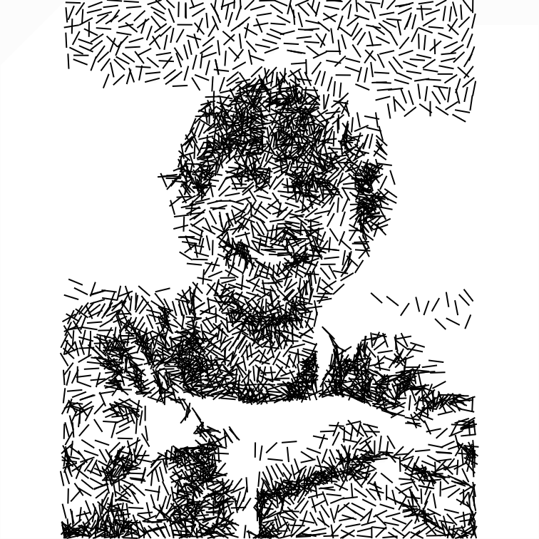

# Image Pipeline

A browser-based node graph for building image processing pipelines. The main trick: an optimisation algorithm takes a raster image and produces a generative line drawing by iteratively minimising the difference between the input and a rasterised vector image.



## Running it

No installation, no build step, no npm.

**Option 1 — Python (easiest)**

```bash
cd optimisation-project
python3 -m http.server 8080
```

Then open [http://localhost:8080](http://localhost:8080) in your browser.

**Option 2 — Node.js**

```bash
npx serve .
```

**Option 3 — VS Code**

Install the [Live Server](https://marketplace.visualstudio.com/items?itemName=ritwickdey.LiveServer) extension, right-click `index.html` → *Open with Live Server*.

> **Why not just double-click `index.html`?**
> The app uses ES modules (`import`/`export`), which browsers block over `file://`. Any local HTTP server works — it just needs to serve files over `http://`.

---

## How to use it

The UI is a node graph. Add nodes from the left sidebar and connect their ports by dragging from one coloured dot to another.

### Basic flow

```
ImageUploader → Grayscale → [opt node] → Rasterize → ShowPixelBuffer
```

1. Add an **ImageUploader** node and load a photo.
2. Add a **Grayscale** node and connect it to the uploader's output.
3. Add an optimisation node (see below) and connect it to the grayscale output.
4. Hit **Run** (top of sidebar) or press the ▶ button on any node to run from there.
5. Add **Rasterize → ShowPixelBuffer** to preview the output, or **ImageDiff** to see the error.

### Preset pipelines

Click any preset button at the bottom of the sidebar to load a ready-made pipeline. These are good starting points.

### Exporting

Click **Export to Console** — this prints the current pipeline as JSON to the browser's developer console. You can paste it back as a preset entry in `pipelines.js`.

---

## Optimisation nodes

| Node | What it does |
|---|---|
| **OptGreedySequential** | Places one line at a time, keeping each stroke only if it reduces the error. Uses blur-based scoring so dense hatching blurs into the right gray level. Usually the best quality. |
| **OptHillClimb** | Starts with random lines and nudges endpoints each round. Fast and simple. |
| **OptGenetic** | Genetic algorithm — tournament selection, crossover, mutation. Good for exploring a wider search space. |
| **OptStipple** | Weighted Voronoi stippling. Produces a dot pattern rather than line hatching. |

All optimisation nodes show a live preview and progress bar while running. Parameters are tunable directly on the node card.

### Key parameters (all opt nodes)

- **lineCount** — number of strokes in the final drawing.
- **penWidthPx** — stroke thickness in pixels at score resolution.
- **scoreScale** — fraction of full resolution used for scoring (0.5 = 4× faster, minimal quality loss).
- **rounds / generations / lineCount** — controls how long the algorithm runs.

---

## File overview

```
index.html      — entry point
main.js         — palette, run button, presets, drag-to-connect
pipeline.js     — node graph engine (topo-sort, edge drawing)
pipelines.js    — presets + serialisation
widgets.js      — DOM card per node
nodes/          — one file per node type
types/          — port type constants and validators
formats/        — VectorImage class
renders/        — example output images
```

---

## Tips

- **Pan** the canvas by holding middle-mouse or using the pan controls.
- **Right-click** a port dot to disconnect it.
- Nodes run in topological order — upstream results are cached, so "Run from here" on a downstream node is fast.
- `scoreScale: 0.5` is a good default. Drop it lower (e.g. `0.25`) for a quick preview, raise it to `1.0` for final quality.
